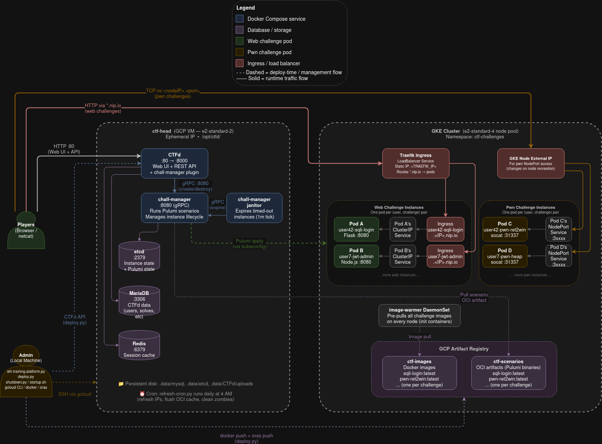

# coolname needed

Complete guide for setting up the training platform from scratch on a new GCP project, operating it day-to-day, and fixing common issues.

**Architecture:** CTFd on a GCP VM (head node) + per-user challenge instances on GKE, orchestrated by chall-manager via Pulumi.



---

## Table of Contents

1. [New Machine Setup (Local)](#1-new-machine-setup-local)
2. [GCP Project Setup (From Scratch)](#2-gcp-project-setup-from-scratch)
3. [Head Node Setup](#3-head-node-setup)
4. [GKE Cluster Setup](#4-gke-cluster-setup)
5. [Traefik Ingress Setup](#5-traefik-ingress-setup)
6. [Docker Compose Services (Head Node)](#6-docker-compose-services-head-node)
7. [First Deploy](#7-first-deploy)
8. [Writing Challenges](#8-writing-challenges)
9. [Daily Operations](#9-daily-operations)
10. [Full Reset (wh-training-platform.py)](#10-full-reset-wh-training-platformpy)
11. [Script Reference](#11-script-reference)
12. [Troubleshooting](#12-troubleshooting)
13. [Cost Management](#13-cost-management)

---

## 1. New Machine Setup (Local)

All deployment scripts run from your local machine (not the head node). You need these tools installed.

### Prerequisites

```bash
# Python
pip3 install pyyaml

# Google Cloud SDK
# Download from https://cloud.google.com/sdk/docs/install or:
curl https://sdk.cloud.google.com | bash
gcloud init
gcloud auth login
gcloud auth application-default login

# Docker (for building challenge images)
# https://docs.docker.com/engine/install/

# Configure Docker for Artifact Registry
gcloud auth configure-docker asia-southeast1-docker.pkg.dev

# Go (for compiling Pulumi scenarios)
# https://go.dev/dl/  — need go 1.21+

# ORAS (for pushing OCI scenario artifacts)
# https://oras.land/docs/installation
# On Kali/Debian:
curl -LO https://github.com/oras-project/oras/releases/download/v1.2.0/oras_1.2.0_linux_amd64.tar.gz
tar -xzf oras_1.2.0_linux_amd64.tar.gz -C /usr/local/bin oras

# kubectl (for local GKE access, optional)
gcloud components install kubectl
```

### Clone and configure

```bash
git clone <repo-url> ~/ctf-archive
cd ~/ctf-archive

# Create the deployment config
cp scripts/.ctf-deploy.env.example scripts/.ctf-deploy.env
```

Edit `scripts/.ctf-deploy.env`:

```
CTFD_URL=http://<HEAD_NODE_IP>
CTFD_TOKEN=<admin-api-token>
AR_IMAGES=asia-southeast1-docker.pkg.dev/<PROJECT_ID>/ctf-images
AR_SCENARIOS=asia-southeast1-docker.pkg.dev/<PROJECT_ID>/ctf-scenarios
TRAEFIK_IP=<TRAEFIK_LB_IP>
```

> You'll fill in the actual values as you complete sections 2-6 below.

---

## 2. GCP Project Setup (From Scratch)

Run all commands from your **local machine**.

### Create project and set billing

```bash
# Create project (ID must be globally unique)
gcloud projects create <PROJECT_ID> --name="ctf-platform"
gcloud config set project <PROJECT_ID>

# Link a billing account (required for GKE, VMs, etc.)
gcloud billing accounts list
gcloud billing projects link <PROJECT_ID> --billing-account=<BILLING_ACCOUNT_ID>
```

### Enable required APIs

```bash
gcloud services enable \
  compute.googleapis.com \
  container.googleapis.com \
  artifactregistry.googleapis.com
```

### Create Artifact Registry repositories

```bash
REGION=asia-southeast1

# Docker images for challenge containers
gcloud artifacts repositories create ctf-images \
  --repository-format=docker --location=$REGION

# OCI artifacts for Pulumi scenario binaries
gcloud artifacts repositories create ctf-scenarios \
  --repository-format=docker --location=$REGION
```

### Grant the compute service account Artifact Registry access

```bash
# Find your project number
PROJECT_NUM=$(gcloud projects describe <PROJECT_ID> --format='value(projectNumber)')
SA="${PROJECT_NUM}-compute@developer.gserviceaccount.com"

gcloud projects add-iam-policy-binding <PROJECT_ID> \
  --member="serviceAccount:${SA}" \
  --role="roles/artifactregistry.reader"

gcloud projects add-iam-policy-binding <PROJECT_ID> \
  --member="serviceAccount:${SA}" \
  --role="roles/container.developer"
```

---

## 3. Head Node Setup

### Create the VM

```bash
ZONE=asia-southeast1-b

gcloud compute instances create ctf-head \
  --zone=$ZONE \
  --machine-type=e2-highmem-4 \
  --boot-disk-size=80GB \
  --image-family=ubuntu-2204-lts \
  --image-project=ubuntu-os-cloud \
  --scopes=cloud-platform \
  --tags=ctf-head
```

> `e2-highmem-4` (4 vCPU / 32 GB) is needed for Docker builds. Can downsize to `e2-medium` after initial setup to save cost.

### Firewall rules

```bash
# SSH
gcloud compute firewall-rules create ctf-head-ssh \
  --allow=tcp:22 --target-tags=ctf-head

# CTFd web UI
gcloud compute firewall-rules create ctf-head-http \
  --allow=tcp:80 --target-tags=ctf-head

# Pwn challenge NodePort range
gcloud compute firewall-rules create ctf-head-pwn \
  --allow=tcp:30000-31000 --target-tags=ctf-head
```

### Install Docker on the head node

```bash
gcloud compute ssh ctf-head --zone=$ZONE

# On the head node:
sudo apt-get update
sudo apt-get install -y docker.io docker-compose-plugin
sudo usermod -aG docker $USER
```

### Set up CTFd + chall-manager

On the head node (`/opt/ctfd/`):

```bash
sudo mkdir -p /opt/ctfd && cd /opt/ctfd

# Clone CTFd
sudo git clone https://github.com/CTFd/CTFd.git

# Clone the chall-manager plugin (MUST use underscore name)
cd CTFd/CTFd/plugins
sudo git clone https://github.com/ctfer-io/ctfd-chall-manager.git ctfd_chall_manager
cd /opt/ctfd
```

Create `/opt/ctfd/.env`:

```bash
sudo tee /opt/ctfd/.env << 'EOF'
HEAD_IP=<VM_EXTERNAL_IP>
TRAEFIK_LB_IP=<TRAEFIK_IP>
DB_PASSWORD=<generate-random-hex>
SECRET_KEY=<generate-random-hex>
EOF
```

Generate random values:
```bash
python3 -c "import secrets; print(secrets.token_hex(16))"
```

Create `/opt/ctfd/docker-compose.yml` — see [Section 6](#6-docker-compose-services-head-node) for the full file.

### Create the chall-manager entrypoint (OCI token refresh)

```bash
sudo tee /opt/ctfd/conf/chall-manager-entrypoint.sh << 'SCRIPT'
#!/bin/sh
get_token() {
  curl -sf -H 'Metadata-Flavor: Google' \
    'http://metadata.google.internal/computeMetadata/v1/instance/service-accounts/default/token' \
    | grep -o '"access_token":"[^"]*"' | cut -d'"' -f4
}
while true; do
  TOKEN=$(get_token)
  if [ -z "$TOKEN" ]; then echo "token empty, retrying..."; sleep 10; continue; fi
  OCI_USERNAME=oauth2accesstoken OCI_PASSWORD="$TOKEN" /chall-manager &
  CHILD=$!
  sleep 3300
  kill "$CHILD" 2>/dev/null; wait "$CHILD" 2>/dev/null
done
SCRIPT
sudo chmod +x /opt/ctfd/conf/chall-manager-entrypoint.sh
```

### Create the Docker credential helper (backup auth)

```bash
sudo tee /opt/ctfd/conf/docker-credential-gce-metadata << 'HELPER'
#!/bin/sh
if [ "$1" = "get" ]; then
  TOKEN=$(curl -sf -H 'Metadata-Flavor: Google' \
    'http://metadata.google.internal/computeMetadata/v1/instance/service-accounts/default/token' \
    | grep -o '"access_token":"[^"]*"' | cut -d'"' -f4)
  printf '{"Username":"oauth2accesstoken","Secret":"%s"}' "$TOKEN"
fi
HELPER
sudo chmod +x /opt/ctfd/conf/docker-credential-gce-metadata

sudo tee /opt/ctfd/conf/docker-config.json << 'EOF'
{
  "credHelpers": {
    "asia-southeast1-docker.pkg.dev": "gce-metadata"
  }
}
EOF
```

---

## 4. GKE Cluster Setup

Run from your **local machine**.

### Create cluster

```bash
ZONE=asia-southeast1-b

gcloud container clusters create ctf-cluster \
  --zone=$ZONE \
  --num-nodes=1 \
  --machine-type=e2-standard-2 \
  --disk-size=50 \
  --enable-autoscaling --min-nodes=1 --max-nodes=10

# Get credentials locally
gcloud container clusters get-credentials ctf-cluster --zone=$ZONE
```

### Create the challenge namespace

```bash
kubectl create namespace ctf-challenges
```

### Create a K8s ServiceAccount for chall-manager

chall-manager needs cluster-admin access. We use a long-lived K8s token (no gcloud dependency on the head node).

```bash
kubectl create serviceaccount chall-manager -n default
kubectl create clusterrolebinding chall-manager-admin \
  --clusterrole=cluster-admin --serviceaccount=default:chall-manager

# Create a long-lived token secret
kubectl apply -f - <<EOF
apiVersion: v1
kind: Secret
metadata:
  name: chall-manager-token
  namespace: default
  annotations:
    kubernetes.io/service-account.name: chall-manager
type: kubernetes.io/service-account-token
EOF

# Extract token and cluster info
TOKEN=$(kubectl get secret chall-manager-token -n default -o jsonpath='{.data.token}' | base64 -d)
CLUSTER_SERVER=$(kubectl config view --minify -o jsonpath='{.clusters[0].cluster.server}')
CLUSTER_CA=$(kubectl config view --minify --raw -o jsonpath='{.clusters[0].cluster.certificate-authority-data}')
```

### Build kubeconfig for the head node

```bash
cat > /tmp/kubeconfig-head <<KUBECONFIG
apiVersion: v1
kind: Config
clusters:
- name: ctf-cluster
  cluster:
    server: ${CLUSTER_SERVER}
    certificate-authority-data: ${CLUSTER_CA}
contexts:
- name: default
  context:
    cluster: ctf-cluster
    user: chall-manager
current-context: default
users:
- name: chall-manager
  user:
    token: ${TOKEN}
KUBECONFIG

# Copy to head node
gcloud compute scp /tmp/kubeconfig-head ctf-head:/tmp/kubeconfig --zone=$ZONE
gcloud compute ssh ctf-head --zone=$ZONE --command="
  sudo mkdir -p /root/.kube && sudo mv /tmp/kubeconfig /root/.kube/config && sudo chmod 600 /root/.kube/config
"
```

### Open GKE node firewall for pwn challenges

```bash
# Allow external TCP to NodePort range on GKE nodes
gcloud compute firewall-rules create gke-nodeport-allow \
  --allow=tcp:30000-32767 \
  --source-ranges=0.0.0.0/0 \
  --target-tags=$(gcloud compute instances list --filter="name~gke-ctf" --format='value(tags.items[0])' | head -1)
```

---

## 5. Traefik Ingress Setup

Run from your **local machine** (with kubectl configured for the GKE cluster).

```bash
# Reserve a static IP for the load balancer
gcloud compute addresses create traefik-ip --region=asia-southeast1
TRAEFIK_IP=$(gcloud compute addresses describe traefik-ip --region=asia-southeast1 --format='value(address)')
echo "Traefik IP: $TRAEFIK_IP"

# Install Traefik via Helm
helm repo add traefik https://traefik.github.io/charts
helm repo update
helm install traefik traefik/traefik \
  --namespace traefik --create-namespace \
  --set service.spec.loadBalancerIP=$TRAEFIK_IP
```

Update `scripts/.ctf-deploy.env` with `TRAEFIK_IP=<the IP from above>`.

---

## 6. Docker Compose Services (Head Node)

Create `/opt/ctfd/docker-compose.yml` on the head node. This defines all 6 services:

```yaml
version: "3.8"

services:
  ctfd:
    build: ./CTFd
    restart: always
    ports:
      - "80:8000"
    environment:
      - DATABASE_URL=mysql+pymysql://ctfd:${DB_PASSWORD}@db/ctfd
      - REDIS_URL=redis://cache:6379
      - SECRET_KEY=${SECRET_KEY}
      - PLUGIN_SETTINGS_CM_API_URL=chall-manager:8080
    volumes:
      - ./CTFd/CTFd/plugins/ctfd_chall_manager:/opt/CTFd/CTFd/plugins/ctfd_chall_manager
      - ./.data/CTFd/uploads:/opt/CTFd/CTFd/uploads
      - ./.data/CTFd/logs:/opt/CTFd/CTFd/logs
    depends_on:
      - db
      - cache

  chall-manager:
    image: ctferio/chall-manager:latest
    restart: always
    entrypoint: ["/opt/entrypoint.sh"]
    volumes:
      - /root/.kube:/root/.kube:ro
      - /opt/ctfd/conf/chall-manager-entrypoint.sh:/opt/entrypoint.sh:ro
      - /opt/ctfd/conf/docker-credential-gce-metadata:/usr/local/bin/docker-credential-gce-metadata:ro
      - /opt/ctfd/conf/docker-config.json:/root/.docker/config.json:ro
    depends_on:
      - etcd

  chall-manager-janitor:
    image: ctferio/chall-manager-janitor:latest
    restart: always
    environment:
      - URL=chall-manager:8080
      - TICKER=1m
      - OTEL_SDK_DISABLED=true
    depends_on:
      - chall-manager

  etcd:
    image: quay.io/coreos/etcd:v3.5.0
    restart: always
    command:
      - etcd
      - --data-dir=/etcd-data
      - --listen-client-urls=http://0.0.0.0:2379
      - --advertise-client-urls=http://etcd:2379
    volumes:
      - ./.data/etcd:/etcd-data

  db:
    image: mariadb:10.11
    restart: always
    environment:
      - MYSQL_ROOT_PASSWORD=${DB_PASSWORD}
      - MYSQL_USER=ctfd
      - MYSQL_PASSWORD=${DB_PASSWORD}
      - MYSQL_DATABASE=ctfd
    volumes:
      - ./.data/mysql:/var/lib/mysql

  cache:
    image: redis:7-alpine
    restart: always
```

### Start services

```bash
cd /opt/ctfd
sudo docker compose --env-file .env build ctfd    # first time only, builds CTFd with plugin
sudo docker compose --env-file .env up -d
```

### Generate CTFd admin API token

1. Open `http://<HEAD_IP>` in browser
2. Complete CTFd setup wizard (create admin account)
3. Go to admin profile (top-right) -> Settings -> Access Tokens -> Generate
4. Copy the token to `scripts/.ctf-deploy.env` as `CTFD_TOKEN=<token>`

---

## 7. First Deploy

Run from your **local machine** in the repo root (`~/ctf-archive/`).

```bash
# Verify config
cat scripts/.ctf-deploy.env

# Deploy all challenges (builds Docker images, compiles Go scenarios, pushes to AR, creates in CTFd)
python3 scripts/utils/deploy.py --all

# Apply image-warmer DaemonSet (pre-pulls images on GKE nodes for faster instance creation)
python3 scripts/utils/gen-image-warmer.py

# Verify all challenges work
python3 scripts/utils/healthcheck.py

# (Optional) Install daily refresh cron on ctf-head
python3 scripts/utils/refresh.py --deploy-cron
```

### Make challenges visible

By default, challenges are deployed as `hidden`. To make them visible to players:

CTFd Admin -> Challenges -> click each challenge -> Edit -> State: **Visible** -> Update

---

## 8. Writing Challenges

This section covers how to create new challenges for the platform. Each challenge lives in its own directory under `challenges/` and consists of a few standard files.

### Challenge directory structure

Challenges are organized by category:

```
challenges/
  <category>/
    <challenge-slug>/
      challenge.yml          # Required — metadata, flag, scoring
      image/                 # Required for web/pwn — Docker container
        Dockerfile
        app.py / vuln.c / ...
        requirements.txt / Makefile / ...
      scenario/              # Required for web/pwn — Pulumi Go program
        main.go
        go.mod
        go.sum
        Pulumi.yaml
      handout/               # Optional — files given to players (downloadable)
        vuln.c
        vuln (compiled binary)
        libc.so.6
      exploit.py             # Optional — reference solution
```

### File-by-file explanation

#### `challenge.yml` — Challenge metadata

The only file the deploy script reads directly. Defines everything CTFd needs to register the challenge.

```yaml
name: "Secure Auth Portal"          # Display name in CTFd
slug: sqli-login                     # Docker image + OCI tag name (defaults to directory name)
category: "Web"                      # CTFd category tab
description: |                       # Markdown — shown to players
  My coworker built this "enterprise-grade" authentication portal.
  Prove him wrong. The flag is in the admin's profile.
value: 200                           # Starting points (dynamic scoring: this is the max)
minimum: 50                          # Floor for dynamic scoring (optional, default 0)
decay: 10                            # Number of solves before reaching minimum (optional, default 0)
flag: "CTF{sql_1nject10n_bypasses_auth}"   # Single string or list of strings
type: web                            # web | pwn | static
mana: 1                              # Cost to spawn instance (optional, default 1)
duration: 3600                       # Instance lifetime in seconds (optional, default 3600)
state: hidden                        # hidden | visible (optional, default hidden)
hints:                               # Optional
  - content: "The login query uses string formatting"
    cost: 75
  - content: "Try: admin' --"
    cost: 150
```

**Field mapping to CTFd API:**

| challenge.yml | CTFd API field | Notes |
|---------------|----------------|-------|
| `value` | `initial` | Starting/max points for dynamic scoring |
| `minimum` | `minimum` | Points floor |
| `decay` | `decay` | Solves until minimum |
| `mana` | `mana_cost` | Instance spawn cost |
| `duration` | `timeout` | Seconds; plugin converts to `"Xs"` for chall-manager |
| `flag` | `/api/v1/flags` | Separate API call per flag |
| `hints` | `/api/v1/hints` | Separate API call per hint |

**Challenge types:**

| Type | What deploy.py does | Instance creation |
|------|-------------------|-------------------|
| `web` | Docker build + push, Go build + ORAS push, CTFd API | Pulumi creates Deployment + Service + Ingress (HTTP URL) |
| `pwn` | Docker build + push, Go build + ORAS push, CTFd API | Pulumi creates Deployment + NodePort Service (`nc host port`) |
| `static` | CTFd API only (+ handout upload) | No instance — just downloadable files |

#### `image/Dockerfile` — Challenge container

The Docker image that runs when a player boots an instance. Built and pushed to Artifact Registry as `<AR_IMAGES>/<slug>:latest`.

**Web challenge example** (Python/Flask):

```dockerfile
FROM python:3.11-slim
WORKDIR /app
COPY requirements.txt .
RUN pip install --no-cache-dir -r requirements.txt
COPY app.py .
EXPOSE 8080
CMD ["python", "app.py"]
```

**Pwn challenge example** (C binary via socat):

```dockerfile
FROM ubuntu:22.04 AS builder
RUN apt-get update -q && apt-get install -y --no-install-recommends gcc libc6-dev make
WORKDIR /build
COPY vuln.c Makefile ./
RUN make

FROM ubuntu:22.04
RUN apt-get update -q && apt-get install -y --no-install-recommends socat && \
    rm -rf /var/lib/apt/lists/*
WORKDIR /app
COPY --from=builder /build/vuln ./vuln
RUN echo 'CTF{your_flag_here}' > /flag.txt && \
    chmod 755 ./vuln && chmod 644 /flag.txt
EXPOSE 31337
CMD ["socat", "-T", "60", "TCP-LISTEN:31337,reuseaddr,fork", "EXEC:./vuln,stderr"]
```

Key rules:
- **Web containers** must listen on port `8080`
- **Pwn containers** must listen on port `31337` (socat wraps the binary)
- The flag goes in `/flag.txt` (pwn) or in the app logic (web)
- Use multi-stage builds for pwn to keep final image small

#### `image/` — Application source files

The actual vulnerable application. Examples:
- `app.py` + `requirements.txt` — Python/Flask web app
- `app.js` + `package.json` — Node.js web app
- `index.php` + `admin.php` — PHP web app
- `vuln.c` + `Makefile` — C binary for pwn

For pwn challenges, the `Makefile` controls compiler flags that set up the vulnerability:

```makefile
CC = gcc
CFLAGS = -fno-stack-protector -no-pie -z execstack -w

all: vuln

vuln: vuln.c
	$(CC) $(CFLAGS) -o vuln vuln.c
```

Common flag combos:
- **No protections**: `-fno-stack-protector -no-pie -z execstack` (ret2win, shellcode)
- **NX only**: `-fno-stack-protector -no-pie` (ROP, ret2libc)
- **Full protections**: default flags (heap, format string)

#### `scenario/main.go` — Pulumi infrastructure program

Defines what Kubernetes resources to create when a player boots an instance. Compiled to a static Linux binary and pushed to Artifact Registry as an OCI artifact.

chall-manager calls this binary with Pulumi config values:
- `identity` — unique per-user ID (used in pod names, hostnames)
- `additional` — key-value map from `challenge.yml`'s `additional` field

**Web scenario** creates: Deployment + ClusterIP Service + Ingress (Traefik).

Full working example (`challenges/test-web/sqli-login/scenario/main.go`):

```go
package main

import (
	"fmt"

	appsv1 "github.com/pulumi/pulumi-kubernetes/sdk/v4/go/kubernetes/apps/v1"
	corev1 "github.com/pulumi/pulumi-kubernetes/sdk/v4/go/kubernetes/core/v1"
	metav1 "github.com/pulumi/pulumi-kubernetes/sdk/v4/go/kubernetes/meta/v1"
	netv1  "github.com/pulumi/pulumi-kubernetes/sdk/v4/go/kubernetes/networking/v1"
	"github.com/pulumi/pulumi/sdk/v3/go/pulumi"
	"github.com/pulumi/pulumi/sdk/v3/go/pulumi/config"
)

func main() {
	pulumi.Run(func(ctx *pulumi.Context) error {
		cfg := config.New(ctx, "")

		// chall-manager sets "identity" to a unique per-user string (e.g. "42")
		id := cfg.Get("identity")
		if id == "" {
			id = "preview"
		}

		// "additional" comes from challenge.yml's additional field
		// deploy.py auto-fills "domain" with TRAEFIK_IP.nip.io
		additional := map[string]string{}
		_ = cfg.GetObject("additional", &additional)
		domain := additional["domain"]
		if domain == "" {
			domain = "placeholder.example.com"
		}

		chal   := "sqli-login"       // ← CHANGE THIS to your challenge slug
		ns     := "ctf-challenges"
		host   := fmt.Sprintf("%s-%s.%s", id, chal, domain)
		labels := pulumi.StringMap{"app": pulumi.String(chal + "-" + id)}

		// 1. Deployment — runs the challenge container
		_, err := appsv1.NewDeployment(ctx, "deploy", &appsv1.DeploymentArgs{
			Metadata: &metav1.ObjectMetaArgs{Namespace: pulumi.String(ns)},
			Spec: &appsv1.DeploymentSpecArgs{
				Selector: &metav1.LabelSelectorArgs{MatchLabels: labels},
				Replicas: pulumi.Int(1),
				Template: &corev1.PodTemplateSpecArgs{
					Metadata: &metav1.ObjectMetaArgs{Labels: labels},
					Spec: &corev1.PodSpecArgs{
						Containers: corev1.ContainerArray{&corev1.ContainerArgs{
							Name:  pulumi.String(chal),
							// ← CHANGE THIS to your Artifact Registry image path
							Image: pulumi.String("asia-southeast1-docker.pkg.dev/<PROJECT>/ctf-images/sqli-login:latest"),
							Ports: corev1.ContainerPortArray{
								&corev1.ContainerPortArgs{ContainerPort: pulumi.Int(8080)},  // web = 8080
							},
							Resources: &corev1.ResourceRequirementsArgs{
								Requests: pulumi.StringMap{
									"cpu":    pulumi.String("25m"),
									"memory": pulumi.String("64Mi"),
								},
								Limits: pulumi.StringMap{
									"cpu":    pulumi.String("500m"),
									"memory": pulumi.String("512Mi"),
								},
							},
						}},
					},
				},
			},
		})
		if err != nil {
			return err
		}

		// 2. Service — internal ClusterIP, routes traffic to the pod
		svc, err := corev1.NewService(ctx, "svc", &corev1.ServiceArgs{
			Metadata: &metav1.ObjectMetaArgs{Namespace: pulumi.String(ns)},
			Spec: &corev1.ServiceSpecArgs{
				Selector: labels,
				Ports: corev1.ServicePortArray{
					&corev1.ServicePortArgs{
						Port:       pulumi.Int(80),
						TargetPort: pulumi.Int(8080),
					},
				},
			},
		})
		if err != nil {
			return err
		}

		// 3. Ingress — Traefik routes <host> to the Service
		_, err = netv1.NewIngress(ctx, "ingress", &netv1.IngressArgs{
			Metadata: &metav1.ObjectMetaArgs{
				Namespace: pulumi.String(ns),
				Annotations: pulumi.StringMap{
					"kubernetes.io/ingress.class": pulumi.String("traefik"),
				},
			},
			Spec: &netv1.IngressSpecArgs{
				Rules: netv1.IngressRuleArray{&netv1.IngressRuleArgs{
					Host: pulumi.String(host),
					Http: &netv1.HTTPIngressRuleValueArgs{
						Paths: netv1.HTTPIngressPathArray{&netv1.HTTPIngressPathArgs{
							Path:     pulumi.String("/"),
							PathType: pulumi.String("Prefix"),
							Backend: &netv1.IngressBackendArgs{
								Service: &netv1.IngressServiceBackendArgs{
									Name: svc.Metadata.Name().Elem(),
									Port: &netv1.ServiceBackendPortArgs{Number: pulumi.Int(80)},
								},
							},
						}},
					},
				}},
			},
		})
		if err != nil {
			return err
		}

		// MUST export "connection_info" — this is what CTFd shows the player
		ctx.Export("connection_info", pulumi.String("http://"+host))
		return nil
	})
}
```

**Pwn scenario** creates: Deployment + NodePort Service (no Ingress — raw TCP).

Full working example (`challenges/test-pwn/pwn-ret2win/scenario/main.go`):

```go
package main

import (
	"fmt"

	appsv1 "github.com/pulumi/pulumi-kubernetes/sdk/v4/go/kubernetes/apps/v1"
	corev1 "github.com/pulumi/pulumi-kubernetes/sdk/v4/go/kubernetes/core/v1"
	metav1 "github.com/pulumi/pulumi-kubernetes/sdk/v4/go/kubernetes/meta/v1"
	"github.com/pulumi/pulumi/sdk/v3/go/pulumi"
	"github.com/pulumi/pulumi/sdk/v3/go/pulumi/config"
)

func main() {
	pulumi.Run(func(ctx *pulumi.Context) error {
		cfg := config.New(ctx, "")

		id := cfg.Get("identity")
		if id == "" {
			id = "preview"
		}

		// deploy.py auto-fills "node_ip" with the GKE node's external IP
		additional := map[string]string{}
		_ = cfg.GetObject("additional", &additional)
		nodeIP := additional["node_ip"]
		if nodeIP == "" {
			nodeIP = "localhost"
		}

		chal   := "pwn-ret2win"      // ← CHANGE THIS to your challenge slug
		ns     := "ctf-challenges"
		labels := pulumi.StringMap{"app": pulumi.String(chal + "-" + id)}

		// 1. Deployment — runs the challenge container (socat + binary)
		_, err := appsv1.NewDeployment(ctx, "deploy", &appsv1.DeploymentArgs{
			Metadata: &metav1.ObjectMetaArgs{Namespace: pulumi.String(ns)},
			Spec: &appsv1.DeploymentSpecArgs{
				Selector: &metav1.LabelSelectorArgs{MatchLabels: labels},
				Replicas: pulumi.Int(1),
				Template: &corev1.PodTemplateSpecArgs{
					Metadata: &metav1.ObjectMetaArgs{Labels: labels},
					Spec: &corev1.PodSpecArgs{
						TerminationGracePeriodSeconds: pulumi.Int(5),
						Containers: corev1.ContainerArray{&corev1.ContainerArgs{
							Name:  pulumi.String(chal),
							// ← CHANGE THIS to your Artifact Registry image path
							Image: pulumi.String("asia-southeast1-docker.pkg.dev/<PROJECT>/ctf-images/pwn-ret2win:latest"),
							Ports: corev1.ContainerPortArray{
								&corev1.ContainerPortArgs{ContainerPort: pulumi.Int(31337)},  // pwn = 31337
							},
							Resources: &corev1.ResourceRequirementsArgs{
								Requests: pulumi.StringMap{
									"cpu":    pulumi.String("10m"),
									"memory": pulumi.String("32Mi"),
								},
								Limits: pulumi.StringMap{
									"cpu":    pulumi.String("500m"),
									"memory": pulumi.String("256Mi"),
								},
							},
						}},
					},
				},
			},
		})
		if err != nil {
			return err
		}

		// 2. NodePort Service — K8s picks a random port in 30000-32767
		//    Player connects to <nodeIP>:<nodePort> via nc
		svc, err := corev1.NewService(ctx, "svc", &corev1.ServiceArgs{
			Metadata: &metav1.ObjectMetaArgs{Namespace: pulumi.String(ns)},
			Spec: &corev1.ServiceSpecArgs{
				Selector: labels,
				Type:     pulumi.String("NodePort"),
				Ports: corev1.ServicePortArray{
					&corev1.ServicePortArgs{
						Port:       pulumi.Int(31337),
						TargetPort: pulumi.Int(31337),
						Protocol:   pulumi.String("TCP"),
					},
				},
			},
		})
		if err != nil {
			return err
		}

		// Build connection_info from the assigned NodePort
		// ApplyT is needed because the port is only known after K8s allocates it
		nodePort := svc.Spec.Ports().Index(pulumi.Int(0)).NodePort()
		connInfo := nodePort.ApplyT(func(port *int) string {
			if port == nil {
				return fmt.Sprintf("nc %s <port>", nodeIP)
			}
			return fmt.Sprintf("nc %s %d", nodeIP, *port)
		}).(pulumi.StringOutput)

		// MUST export "connection_info" — this is what CTFd shows the player
		ctx.Export("connection_info", connInfo)
		return nil
	})
}
```

**Critical:** The scenario MUST call `ctx.Export("connection_info", ...)`. This is what CTFd shows players as their connection string. Without it, the boot button works but players see no URL/host.

#### `scenario/Pulumi.yaml` — Pulumi project config

```yaml
name: sqli-login-scenario
runtime:
  name: go
  options:
    binary: ./main
description: Pulumi scenario for sqli-login
```

The `binary: ./main` line tells Pulumi to use the pre-compiled binary (not `go run`). The deploy script compiles `main.go` → `main` before pushing.

#### `scenario/go.mod` and `go.sum` — Go dependencies

Standard Go module files. All scenarios use the same two dependencies:

```
github.com/pulumi/pulumi-kubernetes/sdk/v4
github.com/pulumi/pulumi/sdk/v3
```

**To generate these for a new challenge**, copy `go.mod` and `go.sum` from any existing challenge (they're identical), then update the module name on line 1:

```bash
cp challenges/test-web/sqli-login/scenario/go.mod challenges/<category>/<slug>/scenario/go.mod
cp challenges/test-web/sqli-login/scenario/go.sum challenges/<category>/<slug>/scenario/go.sum
# Edit go.mod line 1: change "module sqli-login" to "module <slug>"
```

Or generate fresh (slower, downloads ~200MB of deps):

```bash
cd challenges/<category>/<slug>/scenario
go mod init <slug>
go mod tidy
```

#### `handout/` — Player-downloadable files

Files uploaded to CTFd as challenge attachments. Players download these from the challenge page. Common contents:
- Source code (`.c`, `.py`) — so players can analyze locally
- Compiled binary — for pwn challenges (same binary as in the container)
- `libc.so.6` — for ret2libc/ROP challenges (players need the exact libc)

The deploy script auto-uploads all files in `handout/` when creating the challenge.

#### `exploit.py` — Reference solution

Not deployed anywhere. Used by the challenge author to verify the challenge works. Convention: takes the instance URL/host as a command-line argument.

```bash
# Web challenge:
python3 exploit.py http://user42-sqli-login.<TRAEFIK_IP>.nip.io

# Pwn challenge (edit HOST/PORT in script):
python3 exploit.py
```

### Creating a new web challenge

Step-by-step from scratch:

```bash
# 1. Create directory structure
mkdir -p challenges/<category>/<slug>/{image,scenario}

# 2. Write the vulnerable app
#    image/Dockerfile, image/app.py (or .js/.php), image/requirements.txt
#    App MUST listen on port 8080

# 3. Write challenge.yml
#    name, slug, category, description, value, flag, type: web

# 4. Copy scenario boilerplate from an existing web challenge
cp challenges/test-web/sqli-login/scenario/{go.mod,go.sum,Pulumi.yaml} \
   challenges/<category>/<slug>/scenario/

# 5. Write scenario/main.go (copy from sqli-login, change the `chal` variable
#    and the Docker image path)

# 6. Edit go.mod line 1: module name
# 7. Edit Pulumi.yaml: name field

# 8. Deploy
python3 scripts/utils/deploy.py --dir challenges/<category>/<slug>

# 9. Test — boot from CTFd, verify it works, run exploit
```

### Creating a new pwn challenge

```bash
# 1. Create directory structure
mkdir -p challenges/<category>/<slug>/{image,scenario,handout}

# 2. Write the vulnerable binary
#    image/vuln.c, image/Makefile, image/Dockerfile
#    Container MUST listen on port 31337 via socat

# 3. Build locally and copy to handout/
cd challenges/<category>/<slug>/image && make
cp vuln ../handout/
cp vuln.c ../handout/
# For ret2libc: also copy libc.so.6 from the Docker container

# 4. Write challenge.yml (type: pwn)

# 5. Copy scenario boilerplate from an existing pwn challenge
cp challenges/test-pwn/pwn-ret2win/scenario/{go.mod,go.sum,Pulumi.yaml} \
   challenges/<category>/<slug>/scenario/

# 6. Write scenario/main.go (copy from pwn-ret2win, change `chal` and image path)

# 7. Edit go.mod and Pulumi.yaml

# 8. Deploy
python3 scripts/utils/deploy.py --dir challenges/<category>/<slug>
```

### Creating a static challenge

Static challenges have no Docker container or Pulumi scenario — just metadata and optional file downloads.

```bash
mkdir -p challenges/<category>/<slug>/handout

# Write challenge.yml with type: static
# Put downloadable files in handout/

python3 scripts/utils/deploy.py --dir challenges/<category>/<slug>
```

### Grouped challenges (shared instance)

Multiple challenge.yml entries can share a single running instance. Used when one app has multiple flags (e.g., NoteShare 1-5).

**Master challenge** (e.g., `web-noteshare-1`):
- Has `image/` and `scenario/` directories (owns the container)
- Deployed normally — gets its own Docker image and Pulumi scenario

**Satellite challenges** (e.g., `web-noteshare-2` through `web-noteshare-5`):
- Have only `challenge.yml` — no `image/` or `scenario/`
- Point to the master's OCI scenario and slug:

```yaml
# web-noteshare-2/challenge.yml
name: "NoteShare (2/5) — Identity Crisis"
slug: web-noteshare-2
scenario: asia-southeast1-docker.pkg.dev/<PROJECT>/ctf-scenarios/web-noteshare-1:latest
type: web
additional:
  group_master_slug: web-noteshare-1    # resolved to master's CTFd ID at deploy time
# ... rest of fields
```

Key fields for satellites:
- `scenario:` — explicit OCI ref pointing to the master's scenario (skips Go build)
- `additional.group_master_slug:` — the master's directory name. deploy.py resolves this to the master's CTFd ID so chall-manager knows they share an instance

When a player boots any challenge in the group, chall-manager creates one instance. All satellites in the group show the same connection info.

**Deploy order matters:** when using `--all`, challenges deploy alphabetically. The master (`web-noteshare-1`) deploys before satellites (`web-noteshare-2`, etc.), so its CTFd ID is available for resolution.

### What to change in main.go when copying from a template

When copying a scenario from an existing challenge, you need to change:

1. **`chal` variable** — must match your slug (used in pod labels and hostnames)
2. **Docker image path** — must point to your image in Artifact Registry
3. **Container port** — `8080` for web, `31337` for pwn
4. **Resource limits** — adjust CPU/memory based on your app's needs

```go
// Change these lines:
chal := "your-slug"                    // was "sqli-login"
Image: pulumi.String("asia-southeast1-docker.pkg.dev/<PROJECT>/ctf-images/your-slug:latest"),
ContainerPort: pulumi.Int(8080),       // 8080 for web, 31337 for pwn
```

---

## 9. Daily Operations

### Starting the platform

```bash
# From local machine, in ~/ctf-archive/
bash scripts/utils/startup.sh
```

This starts the VM, waits for SSH, updates HEAD_IP in configs, and brings up Docker Compose services. The script prints the CTFd URL when done.

### Stopping the platform

```bash
python3 scripts/utils/shutdown.py
```

Destroys all running instances, deletes image-warmer DaemonSet, waits for GKE pods to drain, stops the VM. All CTFd data (challenges, scores, solves, submissions, users) is preserved on the persistent disk.

### Running maintenance manually

```bash
# From local machine (SSHes into ctf-head for each operation)
python3 scripts/utils/refresh.py

# Or if already set up, it runs automatically at 4 AM on ctf-head:
# Check logs:
gcloud compute ssh ctf-head --zone=asia-southeast1-b \
  --command="tail -50 /var/log/ctf-refresh.log"
```

Maintenance tasks: refresh stale GKE node IPs in pwn challenges, flush OCI cache, restart chall-manager, clean zombie pods, verify services.

### Deploying a single challenge update

```bash
# Rebuild image + scenario + update CTFd
python3 scripts/utils/deploy.py --dir challenges/test-web/sqli-login --force

# Then restart chall-manager (flushes OCI cache for updated scenario)
gcloud compute ssh ctf-head --zone=asia-southeast1-b --command="
  cd /opt/ctfd && sudo docker compose --env-file .env restart chall-manager"
```

### Checking challenge health

```bash
python3 scripts/utils/healthcheck.py
```

Creates an admin test instance for each visible challenge, verifies connectivity, then offers to clean up.

### Stress testing

```bash
python3 scripts/utils/stress.py
```

Prompts for number of concurrent users (1-10), creates admin accounts, fires simultaneous instance creation requests, then enters a live monitoring loop showing CPU/mem/network/disk.

---

## 10. Full Reset (wh-training-platform.py)

Wipes everything and redeploys from scratch. Useful when starting a new CTF cycle.

```bash
# From local machine, in ~/ctf-archive/
python3 scripts/wh-training-platform.py
```

Steps (each prompts for confirmation):
1. Remove all deployed challenges from CTFd
2. Destroy all running instances + delete image-warmer DaemonSet + stop VM
3. Start VM + update configs + start services (runs `startup.sh`)
4. Deploy all challenges (runs `deploy.py --all`)
5. Apply image-warmer DaemonSet (runs `gen-image-warmer.py`)
6. Run stress test (runs `stress.py`)

---

## 11. Script Reference

All scripts run from the repo root (`~/ctf-archive/`).

### Main script (`scripts/`)

| Script | Run where | Purpose |
|--------|-----------|---------|
| `wh-training-platform.py` | Local | Full platform reset + redeploy + stress test |

### Utility scripts (`scripts/utils/`)

| Script | Run where | Purpose |
|--------|-----------|---------|
| `deploy.py` | Local | Build + push + register challenges in CTFd |
| `startup.sh` | Local | Start VM, update IPs, bring up services |
| `shutdown.py` | Local | Destroy instances, drain pods, stop VM |
| `stress.py` | Local | Concurrent instance creation load test |
| `healthcheck.py` | Local | Verify all visible challenges work end-to-end |
| `refresh.py` | Local | Daily maintenance (IPs, OCI cache, zombies) |
| `refresh.py --deploy-cron` | Local | Install daily refresh cron job on ctf-head |
| `refresh-remote.py` | ctf-head | Self-contained refresh (installed by `--deploy-cron`) |
| `gen-image-warmer.py` | Local | Generate + apply image pre-pull DaemonSet |

### deploy.py flags

```bash
python3 scripts/utils/deploy.py --all                    # deploy all challenges
python3 scripts/utils/deploy.py --dir challenges/X       # deploy one challenge
python3 scripts/utils/deploy.py --dir challenges/X --force      # delete + re-create
python3 scripts/utils/deploy.py --dir challenges/X --dry-run    # print steps only
python3 scripts/utils/deploy.py --dir challenges/X --skip-build # CTFd API only, no Docker/ORAS
```

### challenge.yml reference

| Field | Required | Notes |
|-------|----------|-------|
| `name` | yes | Display name in CTFd |
| `slug` | no | Defaults to directory name. Used as Docker image + OCI tag |
| `category` | yes | CTFd category |
| `description` | yes | Markdown |
| `value` | yes | Starting points (maps to CTFd `initial`) |
| `minimum` | no | Floor for dynamic scoring (default 0) |
| `decay` | no | Decay rate (default 0) |
| `flag` | yes | String or list of strings |
| `type` | yes | `web`, `pwn`, or `static` |
| `mana` | no | Cost to spawn instance (default 1, maps to `mana_cost`) |
| `duration` | no | Instance lifetime in seconds (default 3600, maps to `timeout`) |
| `state` | no | `hidden` or `visible` (default `hidden`) |
| `hints` | no | List of `{content, cost}` |
| `scenario` | no | Explicit OCI ref (skips Go build + ORAS push) |
| `additional` | no | Key-value config passed to Pulumi scenario |
| `additional.group_master_slug` | no | For satellite challenges — resolved to master's CTFd ID at deploy time |

---

## 12. Troubleshooting

### Quick reference

| Symptom | Cause | Fix |
|---------|-------|-----|
| Instance spawn fails with OCI error | Stale OCI token or cache | [Restart chall-manager](#restart-chall-manager) |
| "failed to start instance, contact admin" | Challenge deleted from etcd | Redeploy: `deploy.py --dir X --force --skip-build` |
| No connection info shown after boot | Wrong Pulumi export key | Must be `ctx.Export("connection_info", ...)` |
| "Terminating..." stuck forever | Janitor broken or OCI token expired | [Check janitor](#janitor-not-working) |
| Pwn challenge: "connection refused" | Stale `node_ip` in challenge | [Fix stale node IP](#stale-node-ip-on-pwn-challenges) |
| Web challenge: 502/503 error | Pod not ready yet or crashed | [Check pod status](#check-pod-status) |
| Boot button does nothing | chall-manager down | [Check chall-manager](#check-chall-manager) |
| QUOTA_EXCEEDED on spawn | Old scenario cached (was LoadBalancer) | Delete OCI cache + restart chall-manager |
| SSH timeout during Docker build | OOM on small VM | Resize to `e2-highmem-4` for builds |
| Plugin import error | Folder named with hyphens | Rename to `ctfd_chall_manager` (underscore) |
| `deploy.py` HTTP 500 | Wrong API field names | Check [field mapping](#challengeyml-reference) |
| Pods stuck in Terminating | Finalizer or Pulumi issue | `kubectl delete pod X --force --grace-period=0` |

---

### Restart chall-manager

**When:** After pushing updated scenarios, any OCI error, any "OCI interaction failed" message.

```bash
gcloud compute ssh ctf-head --zone=asia-southeast1-b --command="
  cd /opt/ctfd && sudo docker compose --env-file .env restart chall-manager"
```

To also flush the OCI filesystem cache first:

```bash
gcloud compute ssh ctf-head --zone=asia-southeast1-b --command="
  sudo docker exec ctfd-chall-manager-1 sh -c 'rm -rf /root/.cache/chall-manager/oci/*' 2>/dev/null;
  cd /opt/ctfd && sudo docker compose --env-file .env restart chall-manager"
```

---

### Janitor not working

**Symptoms:** Instances never auto-expire. Timer hits 0, shows "Terminating..." forever.

**Check janitor logs:**

```bash
gcloud compute ssh ctf-head --zone=asia-southeast1-b --command="
  sudo docker logs --tail=30 ctfd-chall-manager-janitor-1"
```

**Healthy output:** `starting janitoring` ... `completed janitoring` every 1 minute.

**Common janitor failures:**

| Log message | Fix |
|-------------|-----|
| No output / container not running | Check `docker ps`. Restart: `docker compose up -d chall-manager-janitor` |
| `nil pointer dereference` in OTel | Add `OTEL_SDK_DISABLED=true` to janitor environment |
| `OCI interaction failed` on destroy | Restart chall-manager (expired OCI token) |
| Janitor running but no "janitoring instance" lines | Verify image is `ctferio/chall-manager-janitor:latest` (NOT `ctferio/chall-manager:latest`) |

**Verify janitor config in docker-compose.yml:**

```yaml
chall-manager-janitor:
  image: ctferio/chall-manager-janitor:latest  # MUST be janitor image
  environment:
    - URL=chall-manager:8080      # NO http:// prefix (native gRPC)
    - TICKER=1m
    - OTEL_SDK_DISABLED=true      # prevents OTel crash
```

---

### Stale node_ip on pwn challenges

**Symptoms:** Pwn challenges give "connection refused" or wrong IP. Happens after GKE node pool cycles.

**Quick fix — run refresh script:**

```bash
python3 scripts/utils/refresh.py
```

**Manual fix:**

```bash
# Get current GKE node external IP
gcloud compute ssh ctf-head --zone=asia-southeast1-b --command="
  sudo kubectl get nodes -o wide"

# Patch via CTFd API (replace CHALLENGE_ID and NEW_IP)
curl -X PATCH http://<CTFD_URL>/api/v1/challenges/<ID> \
  -H "Authorization: Token <TOKEN>" \
  -H "Content-Type: application/json" \
  -d '{"additional": {"node_ip": "<NEW_IP>", "domain": "<TRAEFIK_IP>.nip.io"}}'
```

**Prevention:** The daily refresh cron (installed via `refresh.py --deploy-cron`) automatically detects and patches stale node IPs at 4 AM.

---

### Check pod status

```bash
# List all challenge pods
gcloud compute ssh ctf-head --zone=asia-southeast1-b --command="
  sudo kubectl get pods -n ctf-challenges -o wide"

# Check logs of a specific pod
gcloud compute ssh ctf-head --zone=asia-southeast1-b --command="
  sudo kubectl logs <POD_NAME> -n ctf-challenges"

# Get events (useful for scheduling/pull failures)
gcloud compute ssh ctf-head --zone=asia-southeast1-b --command="
  sudo kubectl get events -n ctf-challenges --sort-by=.lastTimestamp | tail -20"
```

---

### Check chall-manager

```bash
# Is the container running?
gcloud compute ssh ctf-head --zone=asia-southeast1-b --command="
  sudo docker ps | grep chall-manager"

# Check logs
gcloud compute ssh ctf-head --zone=asia-southeast1-b --command="
  sudo docker logs --tail=30 ctfd-chall-manager-1"

# List all registered challenges (ground truth)
gcloud compute ssh ctf-head --zone=asia-southeast1-b --command="
  sudo docker exec ctfd-chall-manager-1 curl -sf http://localhost:8080/api/v1/challenge"

# List all active instances
gcloud compute ssh ctf-head --zone=asia-southeast1-b --command="
  sudo docker exec ctfd-chall-manager-1 curl -sf http://localhost:8080/api/v1/instance"
```

---

### Check all Docker services

```bash
gcloud compute ssh ctf-head --zone=asia-southeast1-b --command="
  cd /opt/ctfd && sudo docker compose ps"
```

Expected: all 6 services should show `Up`:
- `ctfd-ctfd-1`
- `ctfd-chall-manager-1`
- `ctfd-chall-manager-janitor-1`
- `ctfd-etcd-1`
- `ctfd-db-1`
- `ctfd-cache-1`

---

### Orphaned K8s resources

**Symptom:** `kubectl get all -n ctf-challenges` shows pods/services, but chall-manager reports no instances.

**Cause:** Challenge deleted from CTFd before instances were cleaned up. Pulumi state lost.

```bash
# See what's orphaned
gcloud compute ssh ctf-head --zone=asia-southeast1-b --command="
  sudo kubectl get all -n ctf-challenges"

# Delete specific resources
gcloud compute ssh ctf-head --zone=asia-southeast1-b --command="
  sudo kubectl delete deployment <NAME> -n ctf-challenges"

# Nuclear option — wipe the entire namespace
gcloud compute ssh ctf-head --zone=asia-southeast1-b --command="
  sudo kubectl delete all --all -n ctf-challenges --force --grace-period=0"
```

**Prevention:** Always destroy instances before deleting challenges. `wh-training-platform.py` handles this automatically.

---

### HEAD_IP stale after VM restart

**Symptom:** CTFd unreachable at the old IP after stopping and starting the VM.

The head node uses an ephemeral IP that changes on every stop/start. `startup.sh` handles this automatically by updating both the head node's `.env` and the local `scripts/.ctf-deploy.env`.

```bash
# If startup.sh wasn't used, fix manually:
NEW_IP=$(gcloud compute instances describe ctf-head --zone=asia-southeast1-b \
  --format='value(networkInterfaces[0].accessConfigs[0].natIP)')

# Update head node
gcloud compute ssh ctf-head --zone=asia-southeast1-b --command="
  sudo sed -i 's/^HEAD_IP=.*/HEAD_IP=${NEW_IP}/' /opt/ctfd/.env
  cd /opt/ctfd && sudo docker compose --env-file .env up -d"

# Update local config
sed -i "s|^CTFD_URL=.*|CTFD_URL=http://${NEW_IP}|" scripts/.ctf-deploy.env
```

---

### UpdateChallenge breaks instances

**Do NOT press "Update" on a `dynamic_iac` challenge in the CTFd admin UI** unless absolutely necessary. The chall-manager `UpdateChallenge` handler deletes the challenge from etcd and re-validates. If validation fails, the challenge is left in a broken state.

**If this happens:**

```bash
# Re-deploy the broken challenge
python3 scripts/utils/deploy.py --dir challenges/<slug> --force --skip-build
```

---

### Docker build OOM on head node

**Symptom:** Build hangs, SSH disconnects, `free -h` shows memory exhausted.

```bash
# Resize VM (requires stop)
gcloud compute instances stop ctf-head --zone=asia-southeast1-b
gcloud compute instances set-machine-type ctf-head \
  --zone=asia-southeast1-b --machine-type=e2-highmem-4
gcloud compute instances start ctf-head --zone=asia-southeast1-b
```

For long builds, use `nohup` to decouple from SSH:

```bash
gcloud compute ssh ctf-head --zone=asia-southeast1-b --command="
  nohup sudo bash -c 'cd /opt/ctfd && docker compose --env-file .env build --no-cache ctfd > /tmp/build.log 2>&1' &"

# Monitor from another terminal:
gcloud compute ssh ctf-head --zone=asia-southeast1-b --command="sudo tail -f /tmp/build.log"
```

---

### Emergency: kill all instances immediately

```bash
# Clean way (via CTFd API — preserves Pulumi state)
python3 scripts/utils/shutdown.py

# Nuclear way (direct kubectl — Pulumi state will drift)
gcloud compute ssh ctf-head --zone=asia-southeast1-b --command="
  sudo kubectl delete all --all -n ctf-challenges --force --grace-period=0"
# Then restart chall-manager to reconcile:
gcloud compute ssh ctf-head --zone=asia-southeast1-b --command="
  cd /opt/ctfd && sudo docker compose --env-file .env restart chall-manager"
```

---

## 13. Cost Management

### Monthly costs (asia-southeast1)

| Resource | Cost | Notes |
|----------|------|-------|
| Head node `e2-highmem-4` (when running) | ~$100/mo | Can downsize to `e2-medium` (~$25/mo) after initial setup |
| Head node boot disk (80 GB, always) | ~$3.20/mo | Persists even when VM is stopped |
| GKE cluster management (1 zonal) | $0 | Free tier |
| GKE nodes `e2-standard-2` (per node) | ~$49/mo | Autoscales 1-10 based on pod demand |
| GKE node disk (50 GB per node) | ~$2/mo | Per running node |
| Traefik LoadBalancer (always) | ~$18/mo | Required for web challenges; billed even when idle |
| Artifact Registry (<1 GB) | $0 | Free tier |

### Reducing costs when not in use

```bash
# Stop the platform (stops VM, GKE drains to min nodes)
python3 scripts/utils/shutdown.py
```

Stopping the VM saves ~$100/mo. The persistent disk ($3.20/mo) and GKE minimum node ($49/mo) continue billing.

To further reduce idle costs:
- Set GKE min nodes to 0: `gcloud container clusters update ctf-cluster --zone=asia-southeast1-b --node-pool=default-pool --enable-autoscaling --min-nodes=0 --max-nodes=10`
- Note: Traefik LB ($18/mo) bills regardless. Delete and recreate if needed for extended idle periods.

### Resize head node for cost savings

After initial Docker builds, you can downsize:

```bash
gcloud compute instances stop ctf-head --zone=asia-southeast1-b
gcloud compute instances set-machine-type ctf-head \
  --zone=asia-southeast1-b --machine-type=e2-medium
gcloud compute instances start ctf-head --zone=asia-southeast1-b
```

Resize back to `e2-highmem-4` before doing Docker builds.
